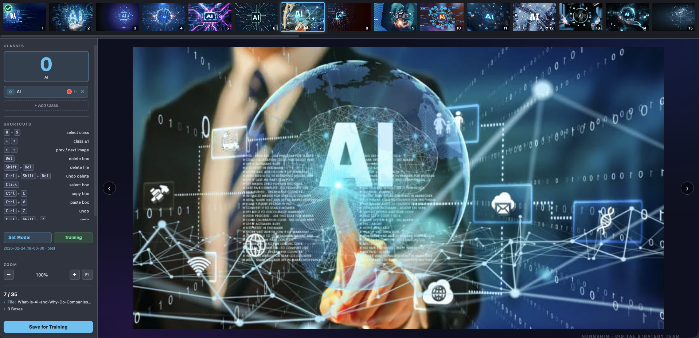

# YOLOv12 어노테이션 & 학습 툴



Flask + React 기반 바운딩 박스 라벨링 도구와 YOLOv12 학습 파이프라인.

---

## 초기 설치

### 1. 저장소 클론

```bash
git clone https://github.com/goddly4123/yolo_training_tool.git
cd yolo_training_tool
```

### 2. Python 환경 설정

[uv](https://docs.astral.sh/uv/getting-started/installation/) 설치 (없는 경우):

```bash
# conda base 환경에서 실행
pip install uv
```

Python 가상환경 생성 및 패키지 설치:

```bash
uv sync
```

> `.venv/` 폴더가 자동으로 생성되고 `pyproject.toml`의 의존성이 설치됩니다.

### 3. Node.js 설치 (없는 경우)

https://nodejs.org 에서 **LTS 버전** 다운로드 후 설치.

설치 확인:
```bash
node -v   # v18 이상이면 OK
npm -v
```

### 4. Node.js 패키지 설치

```bash
npm install --prefix annotation/frontend
```

> `node_modules/`는 git에 포함되지 않으므로 최초 1회 실행 필요.

---

## 실행

### 어노테이션 툴 실행

```bash
bash start.sh
```

브라우저에서 **http://localhost:3000** 접속

---

## 사용 흐름

```
1. to_annotate/images/ 에 이미지 넣기
2. bash start.sh → 브라우저에서 라벨 작업
3. 사이드바 "Save for Training" 클릭
4. 사이드바 "Training" 버튼 → Start
5. runs/<날짜>/weights/best.pt 에서 학습된 모델 확인
```

---

## 처음부터 다시 시작하기

작업 내용을 초기화하고 싶을 때 상황에 맞게 아래 폴더를 삭제하세요.
> **주의:** 삭제한 데이터는 복구할 수 없습니다. 필요한 파일은 미리 백업하세요.

### 상황 1 — 라벨 작업만 다시 하고 싶을 때

작업 이미지와 라벨을 모두 초기화하고, 새 이미지를 넣어서 다시 시작합니다.

```
삭제할 폴더 안의 파일:
  to_annotate/images/   ← 기존 이미지 삭제 후 새 이미지 넣기
  to_annotate/labels/   ← 기존 라벨 파일 삭제
```

### 상황 2 — 학습 데이터를 처음부터 모으고 싶을 때

"Save for Training"으로 저장된 데이터를 전부 초기화합니다.

```
삭제할 폴더:
  BASE_data/            ← 학습용으로 저장된 모든 이미지 + 라벨
```

### 상황 3 — 학습 결과(모델)를 지우고 싶을 때

이전 학습 결과를 모두 삭제합니다.

```
삭제할 폴더:
  runs/                 ← 학습된 모델 파일(best.pt, last.pt) 및 로그
```

### 상황 4 — 완전 초기화 (모든 데이터 삭제)

이미지, 라벨, 학습 데이터, 모델까지 전부 초기화합니다.

```
삭제할 폴더:
  to_annotate/images/   ← 작업 이미지
  to_annotate/labels/   ← 라벨 파일
  BASE_data/            ← 학습용 저장 데이터
  runs/                 ← 학습 결과 모델
```

> `DATA/` 폴더는 학습 중에만 임시로 사용되고 학습 후 자동으로 비워지므로
> 직접 삭제하지 않아도 됩니다.

---

## 요구 사항

| 항목 | 버전 |
|---|---|
| Python | 3.11+ |
| Node.js | 18+ |
| uv | 최신 |
